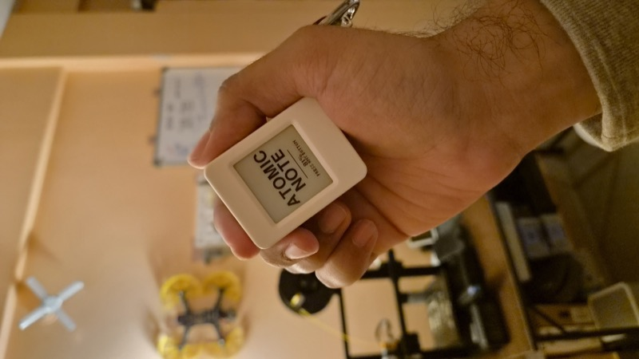

# Atomic Note: E-Paper Voice & Knowledge Companion



**Atomic Note** is an open-source, voice-first, distraction-free pocket companion built on an **ESP32-S3 with a 1.54" e-paper display (200×200)**, an **ES8311 audio codec**, an **SD card module**, a **hardware RTC**, and onboard environment sensors.

Hold a button, speak a thought or expense, and Atomic Note automatically structures it, updates your expense ledger, logs it into an **Obsidian vault**, optionally mirrors it to **Notion**, and allows you to query your personal knowledge base out loud.

---

## Key Features

### 🎙️ Instant Voice Capture & Offline Auto-Sync
- **1-Button Recording**: Hold **Button A** to record voice notes instantly.
- **Offline SD Card Storage**: If Wi-Fi is unavailable or you're away from home, voice notes are automatically saved to the onboard SD card.
- **Automatic Background Sync**: As soon as your device connects to your local Wi-Fi, it automatically uploads pending offline recordings to your companion server, transcribing and tagging them in your vault.

### 📊 Expense Tracking & Budget App
- **7-Day Bar Graph**: View your daily spending for the current week (Sunday through Saturday) directly on the e-paper display, complete with numeric amount labels over each bar.
- **Monthly Spend Total**: View your current month's cumulative expenses at a glance.
- **Toggleable Monthly Budget**: Switch to Budget Mode by tapping **Button A** to dial in your monthly budget in ₹1,000 increments. Shows exact budget percentage used.
- **Persistent NVS Cache**: Cached locally in persistent storage (NVS) so the graph displays instantly without waiting for network connectivity.

### 🗣️ Smart Voice Assistant ("Ask") & Natural Language RAG
- **Ask Questions Out Loud**: Ask questions like *"How much did I spend today?"*, *"What are my tasks for this week?"*, or query any note in your vault.
- **Natural Date Range Parsing**: Understood relative periods like *"today's expenses"*, *"yesterday"*, *"this week"*, or *"last month"*.
- **Exact Ledger Arithmetic**: Expense aggregates are precomputed by python companion logic so the model never makes math errors.
- **Neural TTS Output**: Answers are read out loud using **Kokoro-82M** high-quality neural voice synthesis and rendered as formatted text on the e-paper screen.

### 🛠️ Hardware Utility Apps
- **🎲 Motion-Driven Dice App**: Shake the device to roll a digital die using the MPU6050/IMU accelerometer.
- **📏 Laser Tape Measure App**: Real-time distance measurement using the **VL53L0X Time-of-Flight (ToF)** laser sensor. Features live distance tracking, multi-unit conversion (mm, cm, inches, feet), and a freeze-reading mode.

### 🌐 Built-in Web Portal (Port 80)
- Hosted directly on the ESP32 device (`http://<device-ip>`).
- Manage tasks, toggle completion, set reminders, view note transcripts, configure Wi-Fi credentials, and set companion endpoints without cloud dependencies.

### 🔌 Add-On Sensor Detection
- Auto-probes I2C bus on startup for additional modular sensors (MPU6050/ADXL345 accelerometers, HMC5883 compass, VL53L0X distance sensor, APDS9960 gesture sensor, BME280 environment sensor).

---

## 🔮 Future Scope

- **📦 Custom 3D-Printed Enclosure**: A durable, compact 3D-printed case designed for daily pocket carry (EDC).
- **🧲 Magnetic Snap-On Sensor Modules**: Modular magnetic connector system to hot-swap external sensors (laser distance, environment, compass, gesture) instantly without breadboards or wiring.

---

## System Specifications

| | |
|---|---|
| **MCU** | ESP32-S3, dual-core 240 MHz, 8 MB octal PSRAM, 8 MB flash |
| **Display** | 1.54" SSD1681 e-paper, 200 × 200, 1bpp — holds its image at zero power |
| **Audio** | ES8311 codec, I²S duplex, 16 kHz mono; mic + speaker with PA |
| **Storage** | microSD (SD_MMC, 1-bit) for recordings and note data |
| **Clock** | PCF85063 RTC — survives power loss, wakes the device for reminders |
| **Environment** | SHTC3 temperature and humidity |
| **Input** | Two buttons. That is the entire input grammar |
| **Haptics** | Vibration motor on GPIO 3 (optional, needs a driver transistor) |
| **Power** | Li-ion with a soft-latch circuit; deep sleep between uses |
| **Connectivity** | Wi-Fi 802.11 b/g/n — captive-portal provisioning, no cloud account |

### Optional I²C Add-Ons

Probed at boot. An app whose sensor is absent appears struck through rather
than hidden, so plugging one in visibly unlocks it.

| Sensor | Address | Unlocks |
|---|---|---|
| MPU6050 | `0x68` / `0x69` | **Dice** — shake to roll |
| VL53L0X | `0x29` | **Measure** — laser tape measure |

`0x29` alone does not identify a part: the VL53L0X and VL53L1X share it and
share nothing else. The `tof` serial command reads both ID schemes and reports
which is present.

Only GPIO **1, 2, 3, 5 and 7** are free on this board — octal PSRAM claims
33–37 on top of the flash and peripheral pins. See
[docs/HARDWARE.md](docs/HARDWARE.md) for the full map.

---

## Hardware & Architecture

### ESP32-S3 Firmware (`firmware/atomic_note`)
- **Display Driver**: Custom 1bpp framebuffer `Canvas` driving an SSD1681 200×200 e-paper display.
- **UI Stack**: Non-blocking `Router` driving state machines for screens (`Screen`) with automatic e-paper refresh management and deep-sleep power savings.
- **Audio Codec**: I2S duplex stream (16 kHz mono) via ES8311 codec chip.

### Python Companion Server (`companion/`)
- **HTTP surface (`transcribe_server.py`)**: Server on port `8710`. Speech-to-text runs here, using `faster-whisper` (`distil-large-v3`) locally and offline.
- **Voice out (`speech.py`)**: **Kokoro-82M** neural text-to-speech, plus a normaliser that rewrites answers for the ear — currency spoken as words, markdown stripped, initialisms spelled out.
- **Model (`llm.py`)**: Local **Ollama**, started on demand and stopped when idle. The model is *resolved*, not pinned: it picks the best of what you have installed, so pulling a stronger one is the whole upgrade.
- **Notion sync (`notion_sync.py`, `sync.py`)**: Optional. Notes mirror one-way; expenses sync **both ways**, including deletions.

---

## Quick Setup Guide

### 1. Firmware Prerequisites & Build

Install `arduino-cli` and required libraries:

```bash
brew install arduino-cli
arduino-cli config init
arduino-cli config add board_manager.additional_urls \
  https://espressif.github.io/arduino-esp32/package_esp32_index.json
arduino-cli core update-index
arduino-cli core install esp32:esp32@3.3.11
arduino-cli lib install "Adafruit GFX Library"
arduino-cli lib install "VL53L0X"
```

`Adafruit BusIO` is pulled in automatically as a dependency of Adafruit GFX.
The QR encoder comes from the ESP32 core itself, so there is nothing else to
install.

Compile and flash the firmware:

```bash
./tools/build.sh     # Compile firmware
./tools/flash.sh     # Compile & upload via USB
./tools/monitor.sh   # Serial monitor (115200 baud)
```

*Note: If auto-detection fails, specify your port: `PORT=/dev/cu.usbmodem101 ./tools/flash.sh`.*

---

### 2. Companion Service Setup

Set up the Python environment and models:

```bash
./companion/setup-knowledge.sh
```

Run the companion server:

```bash
python3 companion/transcribe_server.py
```

It prints the address to enter in the device's web app. Install it as a
background service so it starts at login:

```bash
./companion/install-service.sh
```

### Where your notes go

Notes are written to `~/AtomicNote/Atomic Note/` by default. Point it at an
existing Obsidian vault instead — nothing outside its own folder is touched:

```bash
ATOMIC_VAULT=~/MyVault ./companion/install-service.sh
```

| Variable | Default | |
|---|---|---|
| `ATOMIC_VAULT` | `~/AtomicNote` | Vault to write into |
| `ATOMIC_CURRENCY` | `INR` | Currency for expenses |
| `ATOMIC_DEFAULT_MEDIUM` | `UPI` | Payment method when a note names none |
| `ATOMIC_LLM_MODEL` | *best installed* | Pin the language model |
| `ATOMIC_TTS_VOICE` | `af_heart` | Kokoro voice |

Full list in [docs/KNOWLEDGE.md](docs/KNOWLEDGE.md).

### 3. (Optional) Custom Notion Integration

To mirror notes and expenses to your own Notion workspace:
1. Create a Notion Integration token at [notion.so/my-integrations](https://www.notion.so/my-integrations).
2. Share the target databases with that integration (••• → Connections).
3. Run `./companion/setup-knowledge.sh --notion`, which verifies access before
   saving anything — or write `~/.atomic-note-notion.json` yourself:

```json
{
  "token": "ntn_YOUR_NOTION_INTEGRATION_TOKEN",
  "database_id": "YOUR_NOTES_DATABASE_ID",
  "expenses_database_id": "YOUR_EXPENSES_DATABASE_ID"
}
```

---

## Directory Overview

```
firmware/atomic_note/
  atomic_note.ino        Boot sequence and screen initialization
  src/board/             Pin definitions and power management
  src/display/           SSD1681 e-paper panel driver & Canvas surface
  src/input/             Non-blocking button state machine
  src/ui/                Screen interface, Router, and Menu UI
  src/apps/              Application screens (Expenses, Ask, Tasks, etc.)
  src/services/          NVS Settings, Storage, RTC, Wi-Fi, Web App
companion/
  transcribe_server.py   Companion HTTP server
  llm.py                 Local Ollama LLM integration
  knowledge.py           Transcript parsing & Obsidian page generator
  expenses.py            Expense ledger math & relative date range parser
  recall.py              Hybrid search (BM25 + embeddings) over the vault
  books.py               Reading notes, with quote attribution
  threads.py             Linking notes that follow on from each other
  speech.py              Kokoro-82M TTS & the spoken-text normaliser
  notion_sync.py         Notion API client and background mirror queue
  sync.py                Two-way reconciliation for expenses
  notion_setup.py        Interactive Notion credential setup
tools/                   Build, flash, and serial monitor scripts
docs/                    Hardware pin map, controls, knowledge-base design
```

---

## Third-Party Components

Firmware drivers here are written against the datasheets — the SSD1681 panel,
the ES8311 codec, the PCF85063 RTC, the SHTC3 and the MPU6050. Two exceptions,
both installed by `arduino-cli` rather than vendored:

| Component | License | Why |
|---|---|---|
| [Adafruit GFX](https://github.com/adafruit/Adafruit-GFX-Library) | BSD | Fonts and glyph rendering |
| [Pololu VL53L0X](https://github.com/pololu/vl53l0x-arduino) | MIT | Bringing up a VL53L0X needs SPAD calibration and ~80 undocumented register writes; a hand-rolled subset returns numbers that are merely wrong |

On the companion side: `faster-whisper` (MIT), `kokoro-onnx` (MIT), Ollama
(MIT), `icalendar` and `recurring-ical-events` (BSD/LGPL).

## License

MIT — see [LICENSE](LICENSE). Free to use, modify, and build upon.
